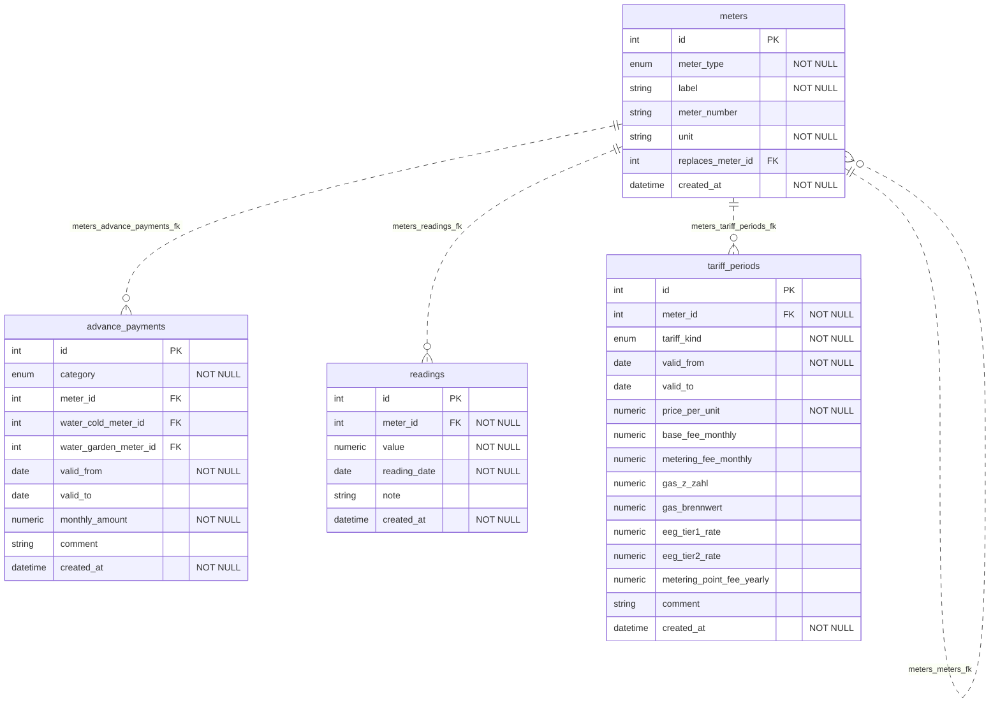

<!-- Auto-generated by scripts/generate_erd.py. Do not edit by hand. -->

```mermaid
erDiagram
    advance_payments {
        int id PK
        enum category "NOT NULL"
        int meter_id FK
        int water_cold_meter_id FK
        int water_garden_meter_id FK
        date valid_from "NOT NULL"
        date valid_to
        numeric monthly_amount "NOT NULL"
        string comment
        datetime created_at "NOT NULL"
    }

    meters {
        int id PK
        enum meter_type "NOT NULL"
        string label "NOT NULL"
        string meter_number
        string unit "NOT NULL"
        int replaces_meter_id FK
        datetime created_at "NOT NULL"
    }

    readings {
        int id PK
        int meter_id FK "NOT NULL"
        numeric value "NOT NULL"
        date reading_date "NOT NULL"
        string note
        datetime created_at "NOT NULL"
    }

    tariff_periods {
        int id PK
        int meter_id FK "NOT NULL"
        enum tariff_kind "NOT NULL"
        date valid_from "NOT NULL"
        date valid_to
        numeric price_per_unit "NOT NULL"
        numeric base_fee_monthly
        numeric metering_fee_monthly
        numeric gas_z_zahl
        numeric gas_brennwert
        numeric eeg_tier1_rate
        numeric eeg_tier2_rate
        numeric metering_point_fee_yearly
        string comment
        datetime created_at "NOT NULL"
    }

    meters ||..o{ advance_payments : "meters_advance_payments_fk"
    meters ||..o{ meters : "meters_meters_fk"
    meters ||..o{ readings : "meters_readings_fk"
    meters ||..o{ tariff_periods : "meters_tariff_periods_fk"
```
